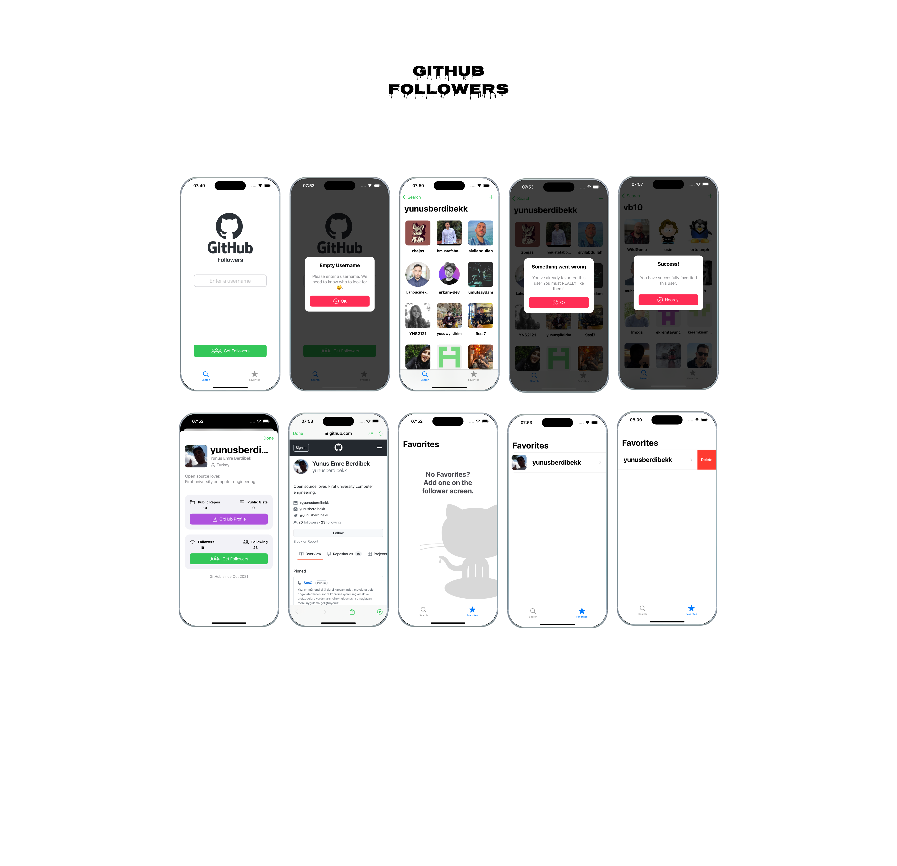

# GithubFollowers
You can find out your followers using Github API and add them to your favorites so you can access them more easily later.
## Built With
- [Swift](https://developer.apple.com/swift/)
- [UIKit](https://developer.apple.com/documentation/uikit)

  

## Overview
* Uses UIKit
* Designed with MVC pattern
* No External Dependencies
* Pagination Support for data
* Auto layout Based
* Leverages free GitHub Rest API

## Design
The app has three key area that we will build out step-by-step
1. Search
2. Favorites
3. Profile
